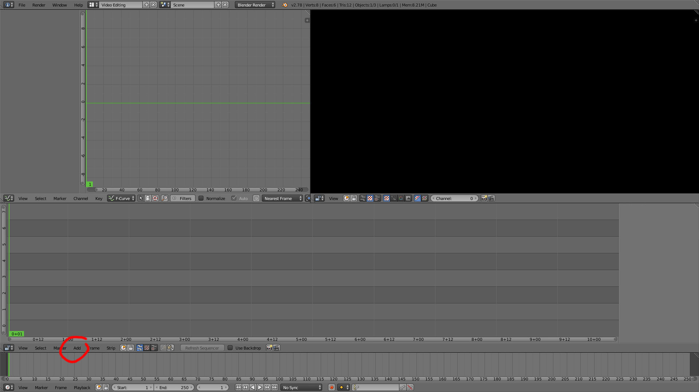

Funscripting Blender Addon
==========================

Funscripting is an addon for Blender to 'script' Launch movements for a video.
With this addon you can create your own scripts (in Funscript format) that can
be played back by Launchcontrol.

[Blender](https://www.blender.org/) is a very powerful free and open-source 3D
editor suite, that comes with a video editor. Scrubbing through a video is very
fast and easy.

The addon consists of a panel for the Sequencer with percentage buttons
representing Launch positions. Each button inserts the corresponding value into
a custom property on the selected strip and marks it as a keyframe. The export
button will save this as a Funscript file that can be played back using
Launchcontrol.

Installation
------------

0. Download and install [Blender](https://www.blender.org/)
1. Download `funscripting.zip` from the [releases](https://github.com/funjack/funscripting/releases) page
2. Start Blender
3. Open User Preferences (Ctrl+Alt+U)
4. Click the Add-ons tab
5. Click Install from File.
6. Select the downloaded `funscripting.zip`
7. Mark the checkbox of `Funscripting Addon`
8. Click `Save User Settings` to auto enable the addon on next startup

If the above steps are not clear, this
[stackexchange](https://blender.stackexchange.com/questions/1688/installing-an-addon)
answer explains the process with screenshots.

Usage
-----

Don't Panic. Blender can be very overwhelming but you don't need to know what
everything does in order to create a Funscript :)

### Switch to video editing layout

Switch to the `Video Editing` layout by pressing the button on the top of the
screen:

### Import a movie file

Click on the `add` menu button in the Sequencer:

Select `Movie`. Browse to your movie file and open it:

Select **only** the video strip by `right-clicking` on it. (So when you see two strips, the
top one represents the audio and bottom video.):

### Script movie

Search the start position by `left-clicking` in the Sequence window and/or
using the `arrow keys` on your keyboard. Then press one of the position number
in the Funscript panel:

Search for the end of the move in the video and press the corresponding
position number in the Funscript panel:

To halt movement simply choose the same position as before to keep at that
position for the time selected (eg frame 10=50% and 80=50% then for 70
frames the Launch will stay at position 50%.)

Repeat the above steps until you are done scripting. Remember that you can save
your Blender project so you don't need to script everything at once ;-)

### Export Funscript

When you are done scripting, save the result as a Funscript by pressing the
`Export as Funscript` button.  Choose a name and location and confirm.

### Playback

Move the file next to a movie and make sure it has the `.funscript` file
extension. Use Kodi or VLC with a Launchcontrol plugin to play. Here is a short
[demo video](https://vid.me/HpwK).

Shortcuts
---------

The following keyboard shortcuts are registered (focus must be on the Video
Sequencer Editor):

- `0-9`, `Numpad 0-9` : Insert position at 0% - 90% at current frame.
- `-`, `Numpad period` : Insert position at 100% at current frame.
- `` ` ``  : Insert a copy of the previous stroke at current frame.
- `=`  : Fill up until the current frame with copies of the previous stroke.

Hint label descriptions
-----------------------

In the funscripting panel there are a couple of hints displayed. These are just
helpful hints, so feel free to ignore when you feel that's appropriate.

- **Previous**: The position of the previous action.
- **Interval**: Time in ms since the previous action, icons:
   - *Warning triangle*: too soon, there is not enough time to technically send
     the action.
   - *Green check-mark*: sweet spot, the previous action will transition into
     this one.
   - *Clock*: there will be a 'pause' in the script, since the previous action
     has already finished.
- **Slowest**: The amount of distance to get the slowest move possible for the
  current frame.
- **Fastest**: The amount of distance to get the fastest move possible for the
  current frame.

The distance calculation for fastest and slowest is currently using
Launchcontrol's 20-80 speed limits rules.

### Example

If previous position was 20, and the slowest hint gives 10. Inserting either 10
or 30 will result in the slowest move in the specified direction.

Tips
----

Generic Blender things:

- The key `g` is the shortcut for grab, to move stuff around, while moving stuff
  around press `x` or `y` to lock horizontal or vertical axis (handy if you
  want to increase some values)
- With the mouse in the graph editor the keys `[` and `]` will select all
  keyframes (inserted points) before or after the current frame
- With the mouse in the graph editor the `b` key will allow you to drag a box
  to select stuff
- `Up arrow` and `Down arrow` will move between keyframes (inserted points)

When scripting, keep in mind that the Launch can only move up and down. That
means the next position is **relative** to the previous one. This works great
for penetration moves, but get tricky when you try to script moments like
touching and licking. Then end and begin position do not necessarily match.
This can also happen if there are hard cuts in the movie. So you need to be
creative when scripting that :-)

Keep the speed limitations in mind. Currently the slowest speed we can safely
use is ~900ms for a full stroke (all the way up or down). Trying to strip
something slower will be sped up to match this speed. The same goes for very
fast movements which is quoting the back of the box "180 strokes/min", which is
3 per second (but that is for strokes of about 20% movement.)
