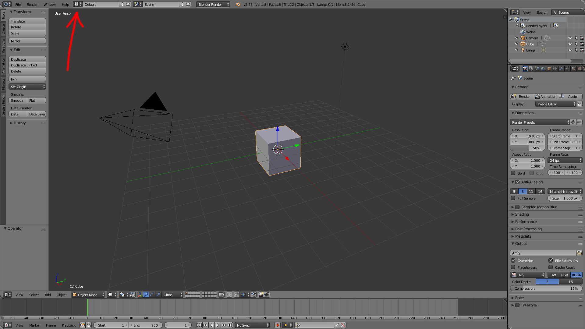
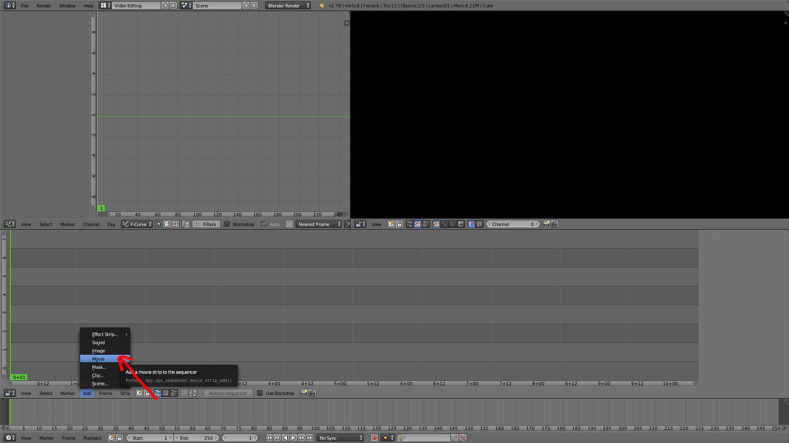
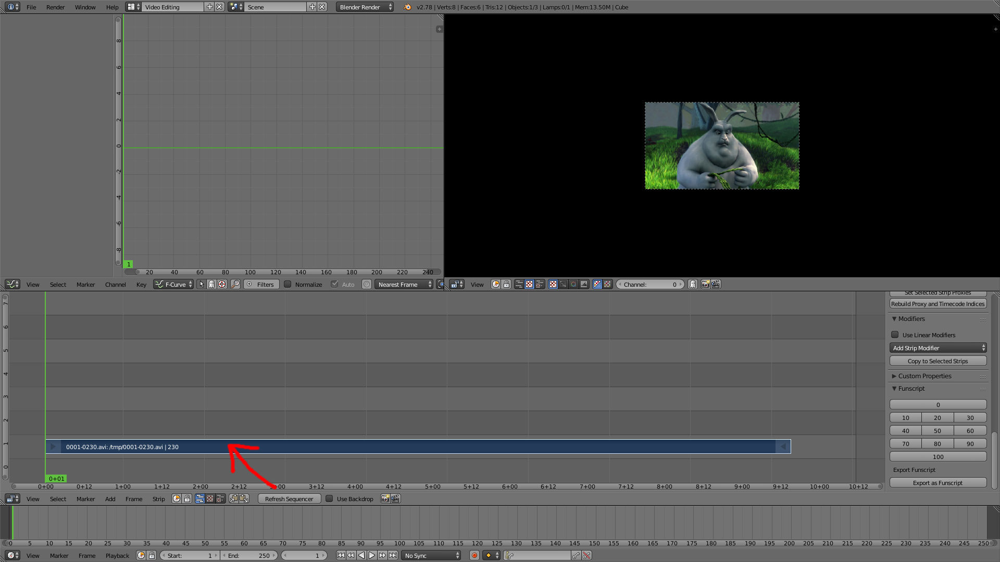
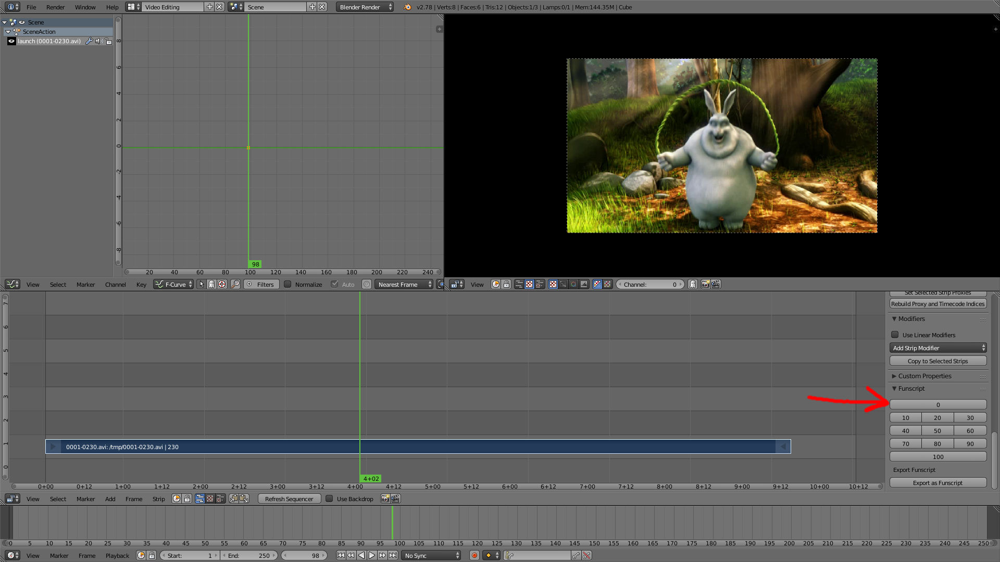
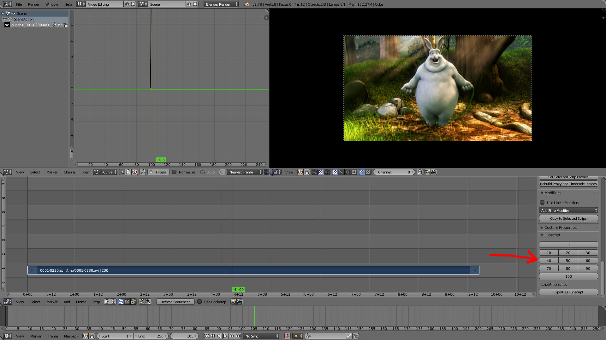
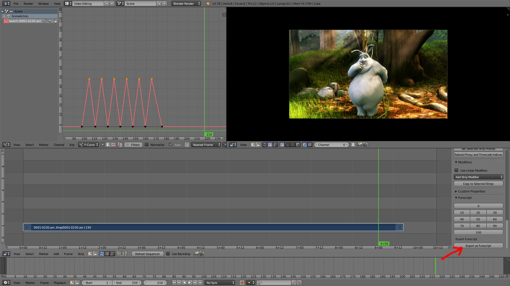

Funscripting Blender Addon
==========================

Funscripting is an addon for Blender to 'script' Launch movements for a video.
With this addon you can create your own scripts (in Funscript format) that can
be played back by Launchcontrol.

[Blender](https://www.blender.org/) is a very powerful free and open-source 3D
editor suite, that comes with a video editor. Scrubbing through a video is very
fast and easy.

The addon consists of a panel for the Sequencer with percentage buttons
representing Launch positions. Each button inserts the corresponding value into
a custom property on the selected strip and marks it as a keyframe. The export
button will save this as a Funscript file that can be played back using
Launchcontrol.

Installation
------------

0. Download and install [Blender](https://www.blender.org/)
1. Download the `funscripting.py` file
2. Start Blender
3. Open User Preferences (Ctrl+Alt+U)
4. Click the Add-ons tab
5. Click Install from File.
6. Select the downloaded `funscripting.py`
7. Mark the checkbox of `Funscripting Addon`
8. Click `Save User Settings` to auto enable the addon on next startup

If the above steps are not clear, this
[stackexchange](https://blender.stackexchange.com/questions/1688/installing-an-addon)
answer explains the process with screenshots.

Usage
-----

Don't Panic. Blender can be very overwhelming but you don't need to know what
everything does in order to create a Funscript :)

### Switch to video editing layout

Switch to the `Video Editing` layout by pressing the button on the top of the
screen:

### Import a movie file

Click on the `add` menu button in the Sequencer:

Select `Movie`. Browse to your movie file and open it:

Select the video strip by `right-clicking` on it. (You may see two strips, the
top one represents the audio.):

### Script movie

Search the start position by `left-clicking` in the Sequence window and/or
using the `arrow keys` on your keyboard. Then press one of the position number
in the Funscript panel:

Search for the end of the move in the video and press the corresponding
position number in the Funscript panel:

To halt movement simply choose the same position as before to keep at that
position for the time selected (eg frame 10=50% and 80=50% then for 70
frames the Launch will stay at position 50%.)

Repeat the above steps until you are done scripting. Remember that you can save
your Blender project so you don't need to script everything at once ;-)

### Export Funscript

When you are done scripting, save the result as a Funscript by pressing the
`Export as Funscript` button.  Choose a name and location and confirm.

### Playback

Move the file next to a movie and make sure it has the `.funscript` file
extension. Use Kodi or VLC with a Launchcontrol plugin to play. Here is a short
[demo video](https://vid.me/HpwK).

Tips
----

When scripting, keep in mind that the Launch can only move up and down. That
means the next position is **relative** to the previous one. This works great
for penetration moves, but get tricky when you try to script moments like
touching and licking. Then end and begin position do not necessarily match.
This can also happen if there are hard cuts in the movie. So you need to be
creative when scripting that :-)

Keep the speed limitations in mind. Currently the slowest speed we can safely
use is ~900ms for a full stroke (all the way up or down). Trying to strip
something slower will be sped up to match this speed. The same goes for very
fast movements which is quoting the back of the box "180 strokes/min", which is
3 per second (but that is for strokes of about 20% movement.)
